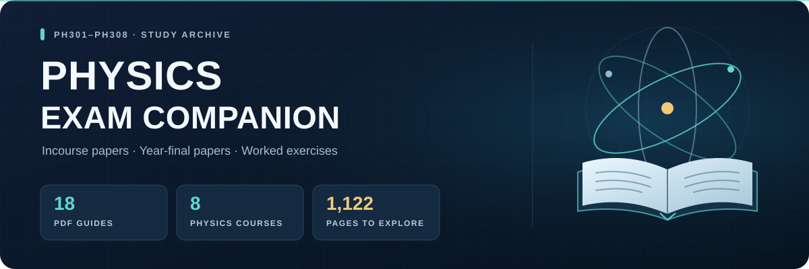

<p align="center">
  
</p>

<p align="center">
  <strong>Incourse papers · Year-final papers · Worked exercises</strong><br>
  A physics study archive for the PH301–PH308 course series.
</p>

<p align="center">
  <a href="https://github.com/EhosanurRahmanRomi/exam-tool-by-gpt-6-astra-max-/releases/download/1.0/solutions.by.gpt.zip"><strong>Download the PDF collection</strong></a>
  &nbsp;·&nbsp;
  <a href="https://github.com/EhosanurRahmanRomi/exam-tool-by-gpt-6-astra-max-/releases/tag/1.0">View release 1.0</a>
  &nbsp;·&nbsp;
  <a href="#course-guide">Browse the courses</a>
</p>

## About the collection

This repository contains **18 PDF solution guides**, organized into **eight physics course folders**, with **1,122 pages** in total. The collection covers PH301–PH308: mechanics and relativity, quantum mechanics, solid state physics, nuclear physics, electrodynamics, lasers and photonics, computational physics, and astrophysics.

The project is presented as a **GPT-6 Astra Max solution archive**. Its PDFs include worked derivations, numerical calculations, figures, and explanations for examination preparation. The document covers identify University of Dhaka course material; these are independently prepared study solutions.

## Start reading

1. [Download the collection from release 1.0](https://github.com/EhosanurRahmanRomi/exam-tool-by-gpt-6-astra-max-/releases/download/1.0/solutions.by.gpt.zip).
2. Extract the ZIP and open the `solutions by gpt` folder.
3. Choose your course folder from the guide below and open a PDF in your preferred reader.

The release download is approximately **8.4 MB**. A copy is also available directly in the repository as [solutions by gpt.zip](solutions%20by%20gpt.zip). Reading the guides requires a PDF reader; there is no application setup or build process.

## Course guide

| Course | Subject | Folder inside the ZIP | PDFs | Pages |
| :--- | :--- | :--- | ---: | ---: |
| **PH301** | Classical Mechanics and Theory of Relativity | `ph301 cmr` | 2 | 130 |
| **PH302** | Quantum Mechanics I | `ph302 qm` | 3 | 174 |
| **PH303** | Solid State Physics I | `ph303 ssp` | 2 | 94 |
| **PH304** | Nuclear Physics | `ph304 np` | 3 | 279 |
| **PH305** | Classical Electrodynamics | `ph305 ced` | 2 | 98 |
| **PH306** | Lasers and Photonics | `ph306 lp` | 2 | 84 |
| **PH307** | Computational Physics | `ph307 cp` | 2 | 72 |
| **PH308** | Introduction to Astrophysics | `ph308 iap` | 2 | 191 |
| **Total** | **Eight courses** | | **18** | **1,122** |

Each course has an incourse volume and a year-final volume. PH302 also includes a guide to **103 selected Zettili entries from Chapters 1–6**, and PH304 includes **82 exercise solutions from Chapters 1–8**.

<details>
<summary><strong>Full document catalog</strong></summary>

The titles below are shortened for readability. The downloaded files retain their original descriptive filenames. Page counts include each document's front matter.

| Course | Document | Pages |
| :--- | :--- | ---: |
| PH301 | Detailed Incourse Solutions, 2026/2025 | 61 |
| PH301 | Detailed Year-Final Solutions, 2024–2022 | 69 |
| PH302 | Quantum Mechanics I: Detailed Incourse Solutions, 2026–2024 | 52 |
| PH302 | Quantum Mechanics I: Detailed Year-Final Solutions, 2024/2023 | 35 |
| PH302 | Zettili: Selected 103 Detailed Solutions, Chapters 1–6 | 87 |
| PH303 | Solid State Physics I: Complete Detailed Incourse Solutions | 40 |
| PH303 | Solid State Physics I: Detailed Year-Final Solutions, 2024–2022 | 54 |
| PH304 | Nuclear Physics: All 82 Detailed Exercise Solutions | 141 |
| PH304 | Nuclear Physics: Complete Detailed Incourse Solutions | 74 |
| PH304 | Nuclear Physics: Detailed Year-Final Solutions, 2024–2022 | 64 |
| PH305 | Classical Electrodynamics: Detailed Incourse Solutions, 2026/2025 | 47 |
| PH305 | Classical Electrodynamics: Detailed Year-Final Solutions, 2024–2022 | 51 |
| PH306 | Lasers and Photonics: Detailed Incourse Solutions | 36 |
| PH306 | Lasers and Photonics: Detailed Year-Final Solutions, 2024–2022 | 48 |
| PH307 | Computational Physics: Detailed Incourse Solutions, 2026–2024 | 28 |
| PH307 | Computational Physics: Detailed Year-Final Solutions, 2024–2022 | 44 |
| PH308 | Introduction to Astrophysics: Detailed Incourse Solutions | 80 |
| PH308 | Introduction to Astrophysics: Detailed Year-Final Solutions, 2024–2022 | 111 |

</details>

## A useful study routine

Choose a question and attempt it before reading the corresponding solution. Work through the derivation, check the units and assumptions, then reproduce the answer with the PDF closed. Use your course notes and reference texts to check a result when a step or convention is unclear.

The coverage follows the papers and problem selections described in each document. Dates vary by course, so use the individual PDF's title and contents to find the relevant examination set. AI-assisted solutions can contain errors; treat the collection as supporting study material and verify important results.

## Repository contents

```text
solutions by gpt.zip          Complete PDF collection
README.md                    Download instructions and course catalog
docs/images/showcase-banner.svg
                             Original repository banner
```

## License

No license file is included in this repository. Reuse and redistribution permissions have not been specified.
